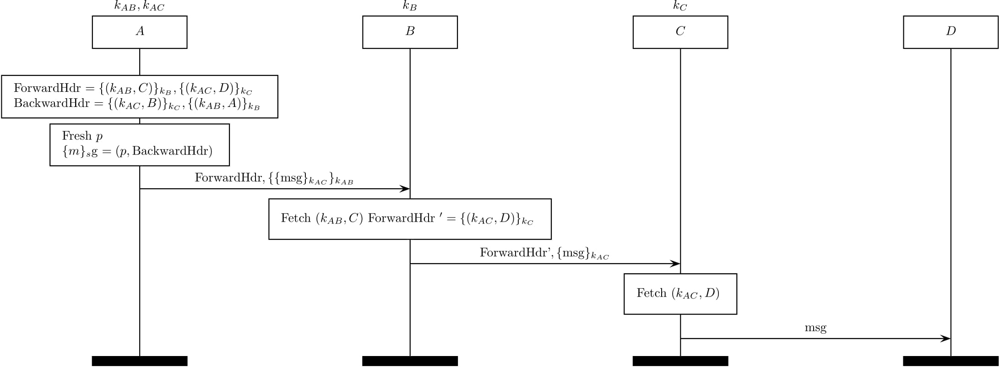

High-speed Onion Routing at the NETwork layer (HORNET)
======================================================

HORNET (citation [40]] in our paper) aims to guarantee privacy by utilizing the
onion routing at the network layer, while achieving scalability by removing
states on the relays.

</img>

The above MSC describes a procedure of data transmission.

Note that all the relays have their own local secret keys which is described
as:
&nbsp;&nbsp;: a local
secret key of  
&nbsp;&nbsp;: a local
secret key of  

The followings are established at the setup phase of the HORNET protocol.
&nbsp;&nbsp;: a shared
key between  and  
&nbsp;&nbsp;: a forward segment generated by  that contains a shared key and the next hop information. It is encrypted with a local secret key  and is delivered to a client ( at the setup phase. 

When a client wants to send a payload ,
he/she sends  together with
BackwardHdr that includes the information about the backward path as .
The message  is
onion-encrypted with shared keys.
Finally, ForwardHdr that contains the information about the forward path is sent 
with the encrypted message.

When a relay receives what a client sends, it fetches a shared key  and
the next hop , decrypts an
onion-encrypted message, and sends the resultant message to the next hop.
