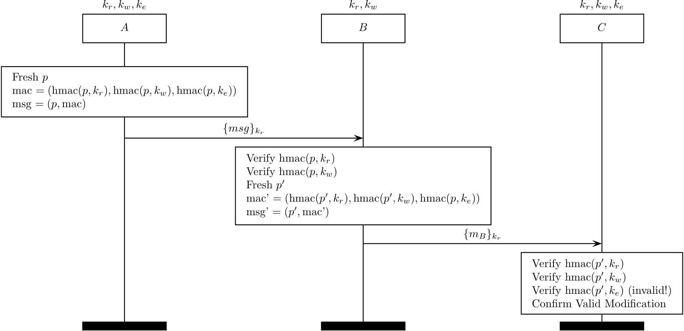

Multi-context TLS (mcTLS)
=========================

Multi-context TLS (mcTLS) (citation [6] in our paper) aims to introduce 
middleboxes while giving them read/write permission.

This is feasible with three MAC keys -- a read MAC key, a write MAC key, and an
endpoint MAC key. A read-only middlebox only receives a read MAC key from
endpoints while a read/write middlebox gets both a read MAC key and a write MAC
key.

Note that there is no way to detect a skipping attack in mcTLS.
The followings are two simple MSCs. One is the protocol with a read-only
middlebox and the other is with a read/write middlebox.

The mcTLS record protocol with a read-only middlebox
----------------------------------------------------
</img>

The following MAC keys are established at the mcTLS handshake protocol.
Note that a read MAC key is also used as an encryption key.

The mcTLS record protocol with a read/write middlebox
-----------------------------------------------------
</img>
