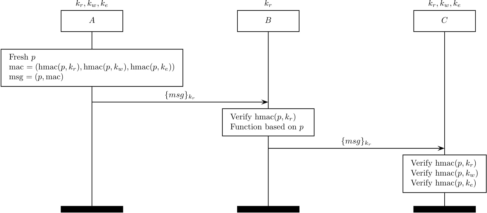

Multi-context TLS (mcTLS)
=========================

Multi-context TLS (mcTLS) (citation [6] in our paper) aims to introduce 
middleboxes while giving them read/write permission.

This is feasible with three MAC keys -- a read MAC key, a write MAC key, and an
endpoint MAC key. A read-only middlebox only receives a read MAC key from
endpoints while a read/write middlebox gets both a read MAC key and a write MAC
key.

Note that there is no way to detect a skipping attack in mcTLS.

</img>

The following MAC keys are established at the mcTLS handshake protocol.
Note that a read MAC key is also used as an encryption key.

&nbsp;&nbsp;:
a read MAC key 
&nbsp;&nbsp;:
a write MAC key 
&nbsp;&nbsp;:
an endpoint MAC key 

When an endpoint wants to send a payload ,
he/she generates three MACs (a read MAC, a write MAC, and an endpoint MAC) and
send them with  as .

When a read-only middlebox that has only  receives a ,
it verifies a read MAC to check whether there is a third-party modification and 
then functions based on  if
it there is no invalid modification.

Note that a receiving endpoint would verify all the MACs and proceed if they are all valid. 
