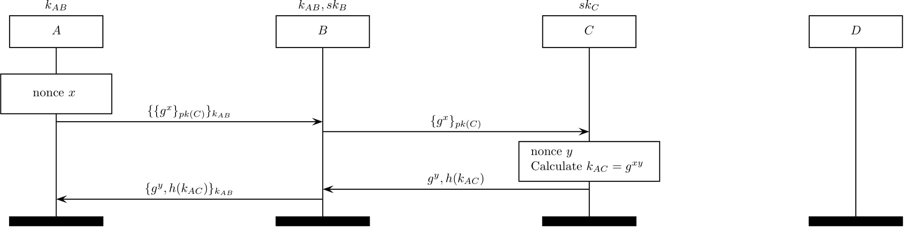
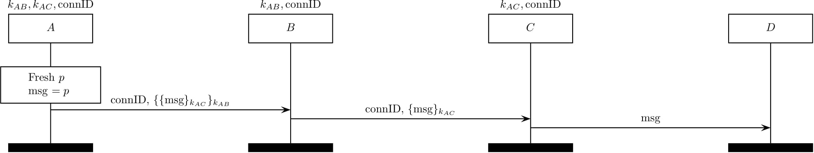

The TOR protocol
================

TOR (citation [8] in our paper) aims to guarantee privacy by utilizing the
onion routing.

The followings are two simple MSCs. One is the protocol with a read-only
middlebox and the other is with a read/write middlebox.

The TOR establishment protocol
------------------------------
</img>

The following MAC keys are established at the mcTLS handshake protocol.
Note that a read MAC key is also used as an encryption key.

&nbsp;&nbsp;:
a read MAC key 
&nbsp;&nbsp;:
a write MAC key 
&nbsp;&nbsp;:
an endpoint MAC key 

When an endpoint sends want to send a payload ,
he/she generates three MACs (a read MAC, a write MAC, and an endpoint MAC) and
send them with  as .

When a read-only middlebox that has only  receives a ,
it verifies a read MAC to check whether there is a third-party modification and 
then functions based on  if
it there is no invalid modification.

The TOR record protocol
-----------------------
</img>

The following MAC keys are established at the mcTLS handshake protocol.
Note that a read MAC key is also used as an encryption key.

&nbsp;&nbsp;:
a read MAC key 
&nbsp;&nbsp;:
a write MAC key 
&nbsp;&nbsp;:
an endpoint MAC key 

When an endpoint sends want to send a payload ,
he/she generates three MACs (a read MAC, a write MAC, and an endpoint MAC) and
send them with  as .

When a read/write middlebox that has both  and  receives a ,
it verifies a read MAC as well as a write MAC to check whether there is any 
modification by a thrid-party or a read-only middlebox and 
then functions based on 
and modifies it into  if
there is no invalid modification.

Note that a receiving endpoint would find an invalid endpoint MAC, since
a read/write middlebox cannot generate an endpoint MAC on . Nevertheless, if a write MAC is
valid, this means there was a valid modification on the path.
