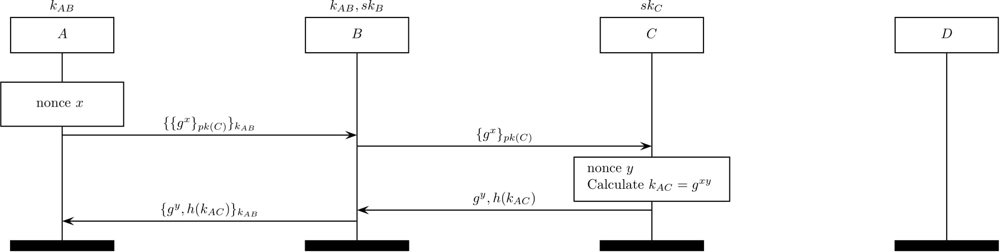

The TOR protocol
================

TOR (citation [8] in our paper) aims to guarantee privacy by utilizing the
onion routing.

</img>

The above MSC describes a procedure of extending a circuit to .
Here,  is a client,  and , and  is a intended server.
Note that  is a shared
key between  and  before this extension.

During the TOR establishment protocol, a client establishes a shared key with
a TOR relay by using a DH key exchange. Finally, all the entities (except
a server  maintain
states (a symmetric key and a forward/backword routing information) identified 
with connection ID (connID), which would be used in the TOR record protocol.
