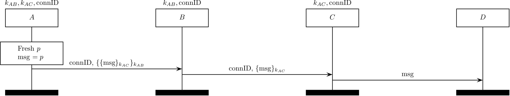

The TOR protocol
================

TOR (citation [8] in our paper) aims to guarantee privacy by utilizing the
onion routing.

</img>

Recall that after the TOR establishment protocol, all the entities (except
a server  maintain
states (a symmetric key and a forward/backword routing information) identified 
with connection ID (connID), which would be used in the TOR record protocol.

When an endpoint wants to send a payload ,
he/she sends  with
a connID.

When a TOR relay  receives 

encrypted with  and

and a connID, it fetches a state with the connID, decrypts an onion-encrypted
message, and sends the resultant message to the next hop.
